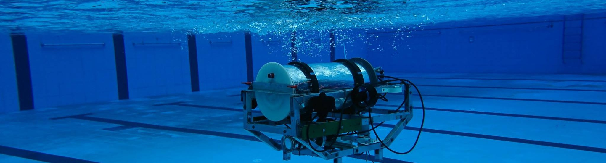

# Team Tiburon Software Inductions 2022

<div>
Follow us on Social Media
<br/>
<br/>
<a href="https://www.linkedin.com/school/tiburonauv/">
  
</a>
<a href="https://www.instagram.com/auvnitrkl/">
  
</a>
<a href="https://www.facebook.com/tiburonauv">
  
</a>
<a href="https://auvnitrkl.github.io/">
  
</a>
</div>
<br/>
<br/>
<br/>


Team Tiburon welcomes you to the Software Induction 2022 for Sophomores. This induction consists of a two weeks simulation challenge followed by a personal interview.

A Tiburon Software Member has the following responsibilities:
1. Perception: Develop software to perceive and process the environment using various sensors.
2. Navigation: Control strategies and path planning algorithms to maneuver the robot
3. Simulation: Present a proof of concept before jumping into costly hardware.
4. Hardware Integration: Develop driver code for various peripherals.

This induction process aims to test and prepare a sophomore to undertake all the responsibilities mentioned above.

## Prerequisites:
1. Intermediate knowledge in C++, ROS, SDF/URDF scripting, and Gazebo Simulation.
3. Basic knowledge of Control Systems (PID Controller).
4. Experience in Computer Vision and OpenCV library.

## General Instructions:
1. [GitHub Discussions Section](https://github.com/auvnitrkl/software_induction22/discussions) shall be used as the communication platform for all announcements, discussions, and Q&A.

2. Raise technical issues or bugs in [GitHub Issues Section](https://github.com/auvnitrkl/software_induction22/issues). We will do our best to solve all the issues.

3. Follow this [Getting Started](GETTING_STARTED.md) for all installation walkthroughs and setup guide.

## Problem Statement:
>You have to add camera plugin in the bot .
>you have to make line following robot .
>camera will take the front feed and accordingly the bot will adjust itself such that it follow the black line .


2. Clone & Build the Repository:
```sh
mkdir -p ~/tiburon_ws/src
cd ~/tiburon_ws/
catkin build
```

## Setup Git SSH:
A device can be registered as a trusted device in your GitHub Account through an SSH key, allowing easy pull and push actions without entering a password every time.

1. Keep pressing Enter key for subsequent steps after running the command below to complete SSH setup with default settings.
```sh
ssh-keygen -t ed25519 -C "your_email@example.com"
```
2. Navigate to your GitHub Account -> Settings -> SSH and GPG Keys -> New SSH Key.

3. Enter any title (your PC name preferably) and copy & paste the generated lines from the terminal using the command below.
```sh
cat ~/.ssh/id_ed25519.pub
```

```sh
cd src
git clone git@github.com:auvnitrkl/software_induction22.git
```
```sh
cd ..
catkin build
```
```sh
source ./devel/setup.bash
```
```sh
roslaunch line_follower_arena line_world.launch
```
On another tab 
```sh
roslaunch line_follower bind.launch 
```
